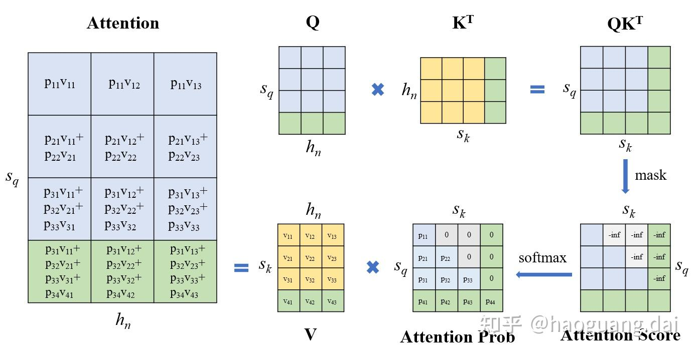
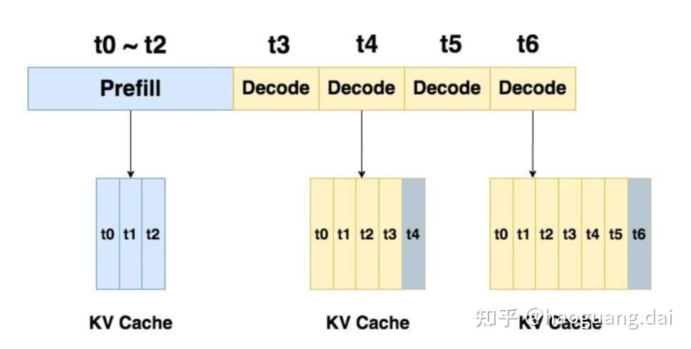
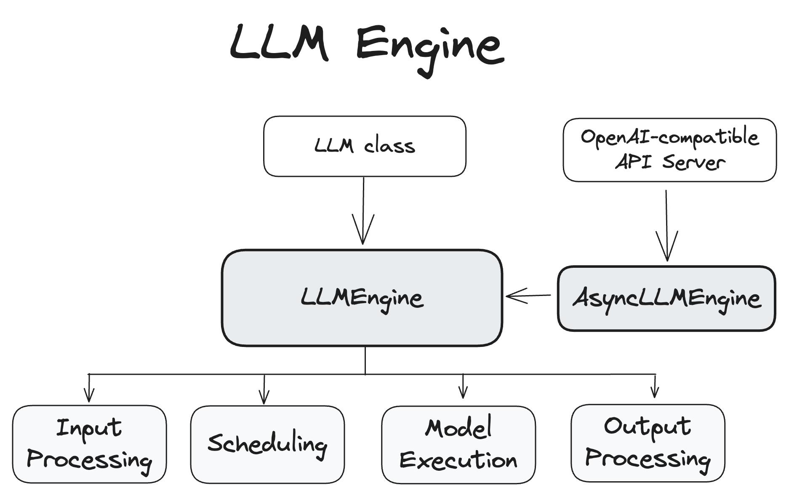

# kv-cache
## KV Cache的可行性
KV cache的可行性值得推敲的地方如下。大模型通常有N个(Transformer) Block级联，每个Block中都有一个attention layer。对于第一个Block，缓存key和value容易理解；但是从第二个Block开始，它们的输入都是上一个Block的输出，只要第一个Block输出发生变化，后面的Block中的key和value就发生变化，此时KV Cache就无法成立。乍一想，计算attention score的时候多一个token，softmax计算不得变化嘛！

1）不管是当前轮还是下一轮，Attention Prob矩阵的第一行，都只会有一个非零元素p11，它的值始终都是1，因为是单项的，能看到key只有一个；同样的，对于第二行（对应第二个query），只能看到前面的两个key，以此类推；如果你还没有明白，那么请验证从在执行Softmax操作时，Attention Score添加绿色部分（新一轮），不会改变Attention Prob蓝色部分的结果；

2）在计算Attention的时候，同样可以验证新一轮计算其蓝色部分结果不变，因为只能看到前面的value。

至此，我们已经证明了KV Cache是可行的。总结一下就是，mask操作是单向的，这使得Attention计算只会在sq方向上不断拼接，而不改变前面的计算结果。

## Prefill和Decode
   Prefill：预填充阶段，把整段prompt喂给模型并执行一次前向过程，直至生成第一个token，也就是图中的t3；这个阶段一次性计算了prompt中所有的KV Cache；
Decode：解码阶段，逐个token输出，如黄色部分所示；这个阶段使用了之前计算好的KV Cache加速推理，同时当前forward过程中计算的新的key和value也被缓存起来，与之前的KV Cache拼接起来，以便下一轮使用。

由于推理存在这两个不同的阶段，因此他们分别会对应不同的性能指标，这些指标也就是当下一些serve框架在优化的目标。比如之前挺火的Kimi的Mooncake，是Prefill和Decode分离的架构，就是针对不同阶段的不同特性进行优化，提升性能，当然就包括下面会提及的性能指标（当然这里主要考虑有大量请求的情况）。

Prefill性能指标：TTFT (Time To First Token)，表示生成第1个token所需的时间。
Decode性能指标：TPOT (Time Per Output Token)，Decode阶段每生成一个token所用的时间。

# PagedAttention

KV cache性能问题：1）此前很多推理系统是为每一个request申请一块连续内存，此时只能选择所有requests中可能输出的最大长度来预分配KV cache，这显然造成了资源浪费，因为短句用不了这么多KV cache；2）实际情况下可能requests比较多，某一时刻某个request解码尚未完成，但始终完全占据为它预分配的连续内存，其中未使用的部分不能为新的request所用，占着茅坑不拉屎；3）存在内存碎片，非连续内存也没办法被利用起来；

PagedAttention解决性能问题：使用类似虚拟内存分页管理的思想，简单来说就是，将申请的内存按照指定的大小block_size划分成很多个block，这些block可以动态的分配给有需要的request，极大减少了资源浪费；

# llm架构
LLMEngine和AsyncLLMEngine类是 vLLM 系统运行的核心，处理模型推理和异步请求处理。

LLMEngine类是 vLLM 引擎的核心组件。它负责接收来自客户端的请求并从模型生成输出。LLMEngine包括输入处理、模型执行（可能分布在多个主机和/或 GPU 上）、调度和输出处理。

- 输入处理：使用指定的标记器处理输入文本的标记化。
- 调度：选择在每个步骤中处理哪些请求。
- 模型执行：管理语言模型的执行，包括跨多个 GPU 的分布式执行。
- 输出处理：处理模型生成的输出，将语言模型中的标记 ID 解码为人类可读的文本。

# 参考文献
GLM-4 (6) - KV Cache / Prefill & Decode https://zhuanlan.zhihu.com/p/716367974

vllm开发手册 https://docs.vllm.ai/en/latest/ 

